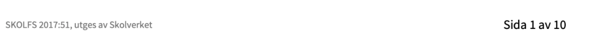

# Webbutvecklare

Ämnet webbutveckling behandlar de tekniker som används för att presentera och bearbeta information i webbläsaren samt utifrån dessa tekniker skapa och vidareutveckla statiska och dynamiska webbsidor, webbplatser eller webbaplikationer.

## Ämnets syfte

Ämnet webbutveckling ska syfta till att eleverna utvecklar färdigheter i att skapa produkter med hjälp av olika webbtekniker. Eleverna ska ges möjligheter att utveckla kunskaper om olika webbteknikers konstruktion och funktionalitet samt kunskaper om samspelet mellan beställare, användare, formgivare och utvecklare. Genom undervisningarna ska eleverna ges mögligheter att utveckla produkter som följer standarder, och riktlinjer för god praxis, användbarhet och tillgänglighet även för användare med funktionsnedsättning. Undervisningen ska leda till att eleverna utvecklar kunskaper om relevanta lagar och andra bestämmelser samt förmåga att göra webbrelaterade etiska övervagande.

I undervisningen ska eleverna ges möjlighet att utveckla kunskaper om och färdighter i att använda verktyg för att producera och kontrollera den kod på en webbplats som exekveras av webbklienten.

undervisningen ska ge eleverna mögligheten att utveckla kunskaper om projekt som arbetsmetod och tillfälle till arbete i projektform.

#### Undervisningen i ämnet webbutveckling ska ge eleverna förutsättningar att utveckla följande

   1. Kunskaper om webbens historia, betydelse och funktionalitet.
   2. Förmåga att planera, genomföra, testa, dokumentera och utvärdera utvecklingsprojekt för webbplatser samt applikationer som bygger på klientbasserade webbtekniker.
   3. Kunskaper om de tekniker som används för att bygga webbplatser och webbapplikationer.
   4. Förmåga att använda externa webbtjänster för inormationsutbyte mellan webbplatser.
   5. Förmåga att utveckla dynamisk presentationslogik.
   6. Förmåga att bygga webbplatser och webbapplikationer enligt standarder och riktlinjer för god praxis samt med god tillgänglighet.
   7. Kunskaper om lager och andra bestämmelser inom området samt förmåga att göra etiska överväganden och reflektera över integritetsfågor
   8. Kunskaper om säkerhet och förmåga att identifera och motarbeta attacker.
   9. Förmåga att använda terminoligi inom området.

### Kurser i ämnet

1. Webbutveckling 1, 100 poäng
2. Webbutveckling 2, 100 poäng, som bygger på kursen webbutveckling 1.
3. Webbutveckling 3, 100 poäng, som bygger på kursen webbutveckling 2. Kursen får bara anordnas i vidareutbildning i form av ett fjärde tekniskt år i gymnasieskola.

- [Webbutveckling 1](Webb%201.md)
- [Webbutveckling 2](Webb%202.md)
- [Webbutveckling 3](Webb%203.md)

