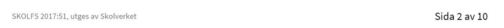
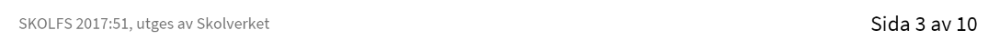
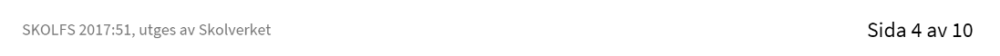

# Webbutveckling 1, 100 poäng

## kurskod: WEUWEB01

Kursen webbutveckling 1 omfattar punkterna 1-3 och 6-9 under rubrikerna Ämnets syfte.

## **Central innehåll**

### Undervisningen i kursen ska behandla följande central innehåll

- Webbensom som platform, dess historia och samhällspåverkan.
- Teknsik orientering om webbens protokoll, adresser, säkerhet och samspelet mellan klient och server.
- publikation av webbplatser med och utan webbpubliceringssystem.
- Processen för ett webbutvecklingsprojekt med målsättningar, planering, specifikation av struktur och design, kodning. optimering. testning. dokumentation och uppföljning.
- Märkspråk och deras inebördes roller, syntax och semantik - där det huvudsakliga innehållet är standarderna för HTML och CSS samt orientering av Ecmaskript och dokumentobjektsmodellen (DOM).
- Teckenkodning, begrepp, standarder och handhavande.
- Bilder och media med alternativa format, optemering och tillgänglighet.
- Riktlinjer för god praxis inom webbutveckling
- Interoperabilitet genom att följa standarder och testa på olika användaragenter.
- Applikationer som fungerar oberoende av val av användarragent, oprativsystem eller hårdvaruplattform och hur tillgänglighet uppnås även för användare med funktionsnedsättning.
- Kvalitetssäkring av applikationens fuktion och validering av kodens kvalitet.
- Säkerhet och sätt att identifiera hot och sårbarheter samt hur attacker kan motverkas genom effektiva åtgärder.
- Lagar och andra bestämmelser som styr dgital information, till exempel personuppgiftslagen och lagen om elektronsik kommunikation.
- Terminologi inom området webbutveckling

## Kunskapskrav

### Betyget E

Eleven beskriver **översiktligt** webbens historia och dess påverkan på samhället och de grundläggande tekniker som webben bygger på. Eleven använder med **visst** handlag webbpubliceringssystem och redogöra **översiktligt** för dess funktionalitet.

Eleven upprättar en **enkel** projektplan för en tänkt produkt. Eleven utvecklar utifrån planen en produkt **i Samråd** med handledare. I arbetet utvecklar eleven kod som med **tillfredsställande** resultat följer standarder och omfattar **någon** av de grundläggande teknikerna för märkspråk och stilmallar. Eleven bearbetar ocks **med viss säkerhet enkel** text, bild eventuell annan media så att de anpassas til produkten.

Produkten är av **tillfredsställande** Kvalitet och följer etablerad god praxis vilket eleven kontrollerar med **begränsade** tester. Eleven testar produkten i **någon** webbläsare. Eleven testar också produkten på **någon** plattform och vidtar **begränsade** åtgärder för att åstakomma snabb överföring av bilder eller andra mediafiler. Dessutom bygger eleven en webbplats som med **tillfredsställande** resultat följer grundläggande principeer för tillgänglighet.

När arbetet är utfört gör eleven en **enkel** dokumentation av de moment som har utförts och utverderar med **enkla** omdömen sitt arbete och resultat. Eleven redogör **översiktligt** för innehållet i lagar och andra bestämmelser som rör publicering på webben samt fölher dem i sitt arbete. Eleven redogör **översiktligt** för relevanta säkerhetslösningar samt hanterar lösenord och annan känslig data på ett etiskt rätt riktigt sätt. Eleven för dessutom **Enkla** resonemang om webbrelaterade frågor om etik och integritet, Eleven använder **med viss säkerhet** temrminologi inom området.

### Betyget D

Betyget D innebär att kunskapskraven för E och till övervägande del för C är uppfylda.

### Betyget C

Eleven beskriver **utförligt** webbens historia och dess påverkan på samhället och de grundläggande tekniker som webben bygger på. Eleven använder med **gott** handlag webbpubliceringssytem och redogör **utförligt** för dess funktionalitet. 

Eleven upprättar en **genomarbetad** projektplan för en tänkt produkt. Eleven utvecklar utifrån planen en produkt **efter samråd** med handledare. I arbetet utvecklar eleven kod som med **tillfresställande** resultat följer standarder och som omfattar **Några** av de grundläggande teknikerna för märkspråk och stilmallar. **I produkteninfogar eleven enkla skript**. Eleven bearbetar **med viss säkerhet och via flera moment** text, bild och eventuell annan media, så att de anpassas till produkten.

Produkten är av **tillfredsställande** kvalitet och följer etablerad god praxis vilket eleven kontrollerar med **automatiserade** tester. Eleven testar produkten i **ågra** webbläsare. Eleven testar också produkten på **några** plattformar **inklusive traditionella datorer eller mobila enheter** och vidtar åtgärder för att åstadkomma snabb överföring av nilder och andra mediafiler. Dessutom bygger eleven en webbplats som med **tillfredsställande** resultat följer grundläggande principer för tillgänglighet **och kontrollerar detta med några automatiserade tester**. 

När arbetet är utfört gör eleven en **noggrann** dokumentation av de moment som har utförts och utvärderar med **nyanserade** omdömen sitt arbete och resultat. Eleven redogör **utförligt** för innehållet i

lagar och andra bestämmelser som rör publicering på webben samt följer dem i sitt arbete. Eleven redogör **utförligt** relevanta säkerhetslösningar samt hanterar lösenord och annan känslig data på ett etiskt riktigt sätt. Eleven för dessutom **välgrundade** resonemang om webbrelaterade frågor om etik och integritet. **Eleven beskriver även hur tredjepartskode kan innebära problem för produktens säkerhet**. Eleven använder **med viss säkerhet** terminologi inom området.

### Betyget B

Betyget B innebär att kunskapskraven för C och till övervägande del för A är uppfyllda.

### Betyget A

Eleven beskriver **utförligt och nyanserat** webbens historia och dess påverkan på samhället och de grundläggande tekniker som webben bygger på. Eleven använder med **mycket gott** handlag webbpubliceringssystem och redogör **utförligt och nyanserat** för dess funktionalitet.

Eleven upprättar en **genomarbetad** projektplan för en tänkt produkt och **reviderar den i behov**. Eleven utvecklar utifrån planen en produkt **efter samråd** med handledare. I arbetet utvecklar eleven kod som med **gott** resultat följer standarder och som omfattar **fler** av de grundläggande teknikerna för märkspråk och stilmallar. **I produkten infogar eleven diskreta domskript**. Eleven bearbetar **med säkerhet och via flera moment** text. bild och eventuell annan media så att de anpassas till produkten.

Produkten är av **god** kvalitet och följer etablerad god praxis vilket eleven kontrollerar med **omfattande automatiserade och manuella** tester. Eleven testar produkten i **flera** webbläsare. Eleven testar ocksåprodukten på **flera** plattformar **inklusive traditionella datorer och mobila enheter**, vidtar **omfattande** åtgärder **samt optimerar** bilder eller andra mediafiler för att åstadkomma snabb överförning av dessa **och för att reducera antalet överföringar per sida**. Dessutom bygger eleven en webbplats som med **gott** resultat följer grundläggande principer för tillgänglighet **och kontrollerar detta med automatiserade tester och simuleringar**.

När arbetet är utfört gör eleven en **nogran och utförlig** dokumentation av de moment som har utförts **med koppling till generella principer och testreultat** och utverderar med **nyanserade** omdömen sitt arbete och resultat **samt ger förslag på hur arbetet kan förbettras**. Eleven redogör **utförligt och nyanserat** för innehållet i lagar och andra bestämmelser som rör publicering på webben samt följer dem i sitt arbete. Eleven redogör **utförligt och nyanserat** för relevanta säkerhetslösningar samt hanterar lösenord och annan känslig data på ett etiskt riktigt sätt. Eleven för dessutom **välgrundade och nyanserade** resonemang om webbrelaterade frågor om etik och integritet. **Eleven beskriver även hur tredjepartskod kan innebära problem för produktens säkerhet samt beskriver grundläggande säkerhetskriterier vid val av webbhotel**. Eleven använder **med säkerhet** terminologi inom området.

