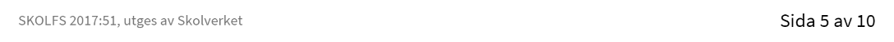
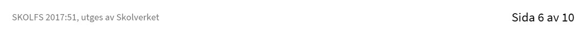
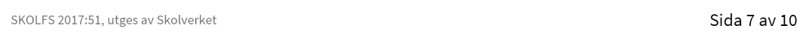

# Webbutveckling 2, 100 poäng

## Kurskod: WEUWEB02

Kursen Webbutvecklare 2 omfattar punkterna 1-3 och 5-9 under rubriken ämnets syfte.

## Centralt innehåll

#### Undervisningen i kursen ska behandla följande centrala innehåll:

- Webben som platform för applikationer av olika slag.
- Utvecklingsprocessen för ett webbtekniskt projekt med målsättningar, planering, specifikation av struktur och design, kodning, optimering, testning, dokumentation och uppföljning.
- Fördjupning i märkspråk där det huvudsakliga innehållet är standarderna för HTML och CSS med särskilt fokus på responsiv design.
- Språk med stöd för variabler för att förenkla CSS-generering.
- Ramverk eller klassbibliotek inom design eller skriptspråk.
- Skriptspråk för webbutveckling på klientsida och dokumentobjektmoddell.
- Bilder, ljud, video och två- eller tredimensionell interaktiv grafik för webbapplikationer.
- Riktlinjer för god praxis inom webbutveckling.
- Uppnånde av interoperabilitet genom att följa standarder och testa på olika plattformar.
- Applikationer som fungerar oberoende av vald plattform och hur tillgänglighet uppnås även för användare med funktionsnedsättning.
- Kvalitetssäkering av applikationens funktion och validering av kodens kvalitet.
- Lagar och andra bestämmelser som styr digital information, till exempel personuppgiftslagen och lagan om elektronisk kommunikation.
- Säkerhet och sätt att identifiera hot och sårbarheter samt hur attacker kan motverkas genom effektiva åtgärder.
- Terminologi inom området webbutveckling.

## Kunskapskrav

### Betyget E

Eleven beskriver **översiktligt** webben som platform samt gör en **enkel** jämförelse med **något** annat alternativ.

Eleven gör en **enkel** projektplan för en tänkt produkt. Utifrån projektplanen utvecklar eleven **i samråd** med handledare produkten där logiker som styr innehåll, design och beteende **i begränsad utsträckning** är åtskilda. I arbetet utvecklar eleven kod som med **tillfredsställande** resultat följer standarder och som omfattar **någon** teknik för märkspråk och stilmallar där eleven **i begränsad utsträckning** använder tekniker för att generera stilmallskod. I arbetet bearbetar eleven med **tillfredsställande** resultattext., bild och eventuell annan media så att de blir anpassade för aatt fungera i produkten. Eleven ytvecklar med **tillfredsställande** funktionalitet inom något eller några av områdena domskript, interaktiv 2d-grafik, 3d-grafik eller animationer. I sitt arbete inkluderar eleven **någon enkel** funktion från ett klassbibliotek eller ramverk inom områdena design eller skript.

Produkten är av **tillfredsställande** kvalitet när det gäller funktion vilket eleven kontrollerar med hjälp av **någon** test. Dessutom kontrollerar eleven **med viss säkerhet** produktens tillgänglighet med automatiserade tester. Eleven vidtar **någon** åtgärd för att åstadkomma snabb överföring av bilder och andra mediafiler. 

När arbetet är utfört gör eleven en **enkel** dokumentation av de moment som har utförts samt utvärderar med **enkla** omdömen sitt arbete och resultat. Eleven redogör **översiktligt** för innehållet i lagar och andra bestämmelser som rör publicering på webben samt följer dem i sitt arbete. Dessutom för eleven **enkla** resonemang kring webbrelaterade frågor om etik och integritet. Eleven tar hänsyn till säkerhetsaspekter i sitt arbete och i fråga om produkten samt kontrollerar produktens säkerhet med **någon** test. Eleven använder **med viss säkerhet** terminologi inom området.

### Betyget D

Betyget D innebär att kunskapskraven för E och till övervägande del C är uppfyllda

### Betyget C

Eleven beskriver **utförligt** webben som plattform samt gör en **välgrundad** jämförelse med **några** andra alternativ.

Eleven gör en **genomarbetad** projektplan för en tänkt produkt. Utifrån projektplanen utvecklar eleven **efter samråd** med handledare produkten där logiker som styr innehåll. design och beteende är åtskilda. I arbetet utvecklar eleven kod som med **tillfredsställande** resultat följer standarder och som omfattar **några** tekniker för märkspråk och stilmallar där eleven använder tekniker för att generera stilmallskod. I arbetet bearbetar eleven med **tillfredställande** resultat **och via flera moment** text, bild och eventuell annan media så att de blir anpassade för att fungera i produkten. Eleven utvecklar med **tillfredställande** resultat fuktionalitet inom något eller några av områdena domskript, interaktiv 2D-grafik, 3D-grafik eller animationer. I sitt arbete inkluderar eleven **några** funktioner från ett klassbibliotek eller ramverk inom områdena design eller skript.

Produkten är av **tilllfredställande** kvalitet när det gäller funktion vilket eleven kontrollerar med hjälp av **några** tester. Dessutom kontrollerar eleven **med viss säkerhet** produktens tillgänglighet med automatiserade tester **och begränsad manuell testning**. Eleven vidtar **Några** åtgärder för att åstadkomma snabb överföring av bilder och andra mediafiler.

När arbetet är utfört gör eleven en **noggrann** dokumentation av de moment som har utförts samt utvärderar med **nyanserade** omdömen sitt arbete och reslutat. **I utvärderingen resonerar eleven kring eventuella accikelser samt motiverar översiktligt de val som gjoerts**. Eleven redogör **utförligt** för innehållet i lagar och andra bestämmelser som rör publicering på webben samt följer dem i sitt arbete. Dessutom för eleven **välgrundade** resonemang kring webbrelaterade frågor om etik och integritet. Eleven tar hänsyn till säkerhetsaspekter i sitt arbtete och i frågan om produkten samt kontrollerar produktens säkerhet med **några** tester. Eleven använder **med viss säkerhet** terminologi inom området.

### Betyget B

Betyget B innebär at kunskapskraven för C och till övervägande del A är uppfyllda

### Betyget A

Eleven beskriver **utförligt och nyanserat** webben som en plattform samt gör en **välgrundad och nyanserad** Jämförelse med **flera** andra alternativ.

Eleven gör en **genomarbetad** projektplan för en tänkt produkt, **vid behov reviderar eleven planen**. utifrån projektplanen utvecklar eleven **efter samråd** med handledare produkten där logiker som styr innehåll, design och beteende **i omfattande utsträckning** är åtskilda. I arbetet utvecklar eleven kod som med **gott** reslutat följer standarder och som omfattar **flera** tekniker för märkspråk och stilmallar där eleven **i omfattande utsträckning** använder tekniker för att generera stilmallskod. I arbetet bearbetar eleven med **gott** resultat **och via flera moment** text, bild och eventuell annan media så att de blir anpassade för att fungera i produkten. Eleven utvecklar med **gott** resultat funktioalitet inom något eller några av områdena domskript, interaktiv 2D-grafik, 3D-grafik eller animationer. I sitt arbete inkluderar eleven **flera** funktioner **av komplex natur** från ett klassbibliotek eller ramverk inom områdena design elller script.

Produkten är av **god** kvalitet när det gäller funktion vilket eleven kontrollerar med hjälp av **flera** tester, **även manuella**. Dessutom kontrollerar eleven **med säkerhet** produktens tillgånglighet med automatiserade tester **och simuleringar samt manuella tester**. Eleven vidtar **optimeringar av** bilder och andra mediafiler för att åstadkomma snabb överföring av dessa **och vidtar åtgärder för att reducera antal överföringar per sida**.

När arbetet är utfört gör eleven en **noggrann och utförlig** dokumentation av de moment som har utförts **med koppling till generella principer och testreultat** samt utvärderar med **utförliga och nyanserade** omdömen sit arbete och resultat **samt ge förslag på hur arbetet kan förbättras**. **I utvärderingen resonerar eleven kring eventuella avvikelser samt motiverar utförligt de val som har gjorts**. Eleven redogör **utförligt och nyanserat** för innehållet i lagar och andra bestämmelser som rör publicering på webben samt följer dem i sitt arbete, Dessutom för eleven **välgrundade och nyanserade** resenomang kring webbrelaterade frågor om etik och integritet. Eleven tar hänsyn till säkerhetsaspekter i sitt arbete och frågor om produkten samt kontrollerar produktens säkerhet med **dlera** tester. Eleven använder **med säkerhet** terminologi inom området.

