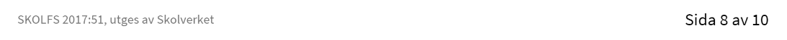
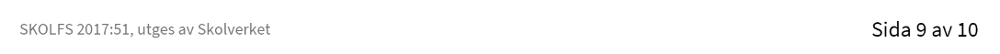

# Webbutveckling 3

## kurskod: WEUWEB33

kursen Webbutveckling 3 omfattar punkterna 2-9 under rubiken Ämnets syfte. Kursen får bara anordnas i vidareutbildning i form av ett gjärde tekniskt år i gymnasieskolan.

## Centralt innehåll

#### undervisningen i kursen ska behandla följande centrala innehåll:

- Konsumtion av webbtjänster, protokoll, gränssnitt och format för datautbyte.
- Processen för ett webbutvecklingsprojekt enligt standardiserad metod för mjukvaruutveckling.
- Verktyg för pakethantering,
- Optimering av processer med hjälp av verktyg, tell exempel minifiering av javascript och CSS.
- Riktlinjer för god praxis inom webbutveckling.
- Klientsidestekniker för webbapplikationer.
- Skriptspråk för webbutveckling på klientsidan och dokumentobjektmodellen.
- Interoperabilitet
- Applikationer som fungerar oberoende av val av användaragent, operativsystem eller hårdvaruplattform.
- kvalitetssäkring av applikationens funktion samt validering av kodens kvalitet,
- Kvaitetssäkring av skript genom olika manuella och automatiserade tester, till ecempel med enhetstester.
- Lagar och andra bestämmelser som styr digital information.
- Säkerhet och sätt att identifiera got och sårbarheter samt hur attacker kan motverkas genom effektiva åtgärder.
- Terminologi inom området webbutveckling.

## kunskapskrav

### Byteget E

Eleven följer **med viss säkerhet** en projektplan för framtagning av en eller flera produkter. Planen uppfyller standardierad projektmetodik för mjukvaruutvecling. Utifrån projektplanen utvecklar eleven **i samråd** med handledare produkten eller produkterna där logiker som styr innehåll, design och beteende är åtkilda. Eleven använder **med viss säkerhet** pakethantering vid installation av olika klassbibliotek och ramverk. I arbetet utvecklar eleven kod som med **tillfredsställande** resultat följer standarder och etablerad god praxis.

Eleven utvecklar **något** skript för användarintraktion och **något** skript för kommunikation med Webbtjänster med **tillfredsställande** funktionalitet. Elevenanvänder **med viss säkerhet enkla** tekniker för asynkrona anrop för sin produkt. Dessutom utvecklar eleven två- eller tredimensionell interaktiv grafik med **tillfredsställande** funktionalitet. Produkten eller produkterna är av tillfredsställande kvalitet när det geller funktion och tillgänglighet. Detta kontrollerar elevenmed **automatiserade** tester. Eleven vidtar **Någon** åtgärd för att åstadkomma god prestanda för produkten eller produkterna.

När arbetet är utfört gör eleven en **enkel** dokumentation i enlighet med vald projektmedtod samt utvärderar med **enkla** omdömen sitt arbete och resultat. Eleven följer i sitt arbete lagar och andra

bestämmelser som rör mjikvaruutveckling och publicering på webben. Eleven tar hänsyn till säkerhetsaspekter i sitt arbete och i fråga om produkten eller produkterna samt kontrollerar säkerheten genom **begränsade** tester. Eleven använder **med viss säkerhet** terminologi inom området.

### Betyget D

Betyget D innebär att kunskapskraven för E och till övervägande del för C är uppfyllda.

### Betyget C

Eleven följer **med viss säkerhet** en projektplan för framtagning av en eller flera produkter. Planen uppfyller standadiserad projktmetodik för mjukvaruutveckling. Utifrån projektplanen utvecklar eleven **efter samråd** med handledare produkten eller produkterna där logiker som styr innehåll, design och beteende är åtkilda. Eleven använder **med viss säkerhet** pakethantering vid installation av olika klassbibiliotek och ramverk. I arbetet utvecklar kod som med **tillfredsställande** resultat följer standarder och etablerad god praxis.

Eleven utvecklar **några** skript för användarinteraktion och **några** skript för kommunikation med webbtjänster med **tillfredsställande** funktionalitet. Eleven använder **med viss säkerhet** tekniker för asynkrona anrop för sin produkt. Dessutom utvecklar eleven yvå- eller tredimensionell interaktiv grafik med **tillfredsställande** funktionalitet. Produkten eller produkterna är av **tillfredstääalnde** kvalitet när det gäller funktion och tillgänglighet. Detta kontrollerar eleven med **manuella och automatiserade** tester. Eleven vidtar **några** åtgärder för att åstadkomma god prestanda för produkten eller produkterna.

När arbetet är utfört gör eleven **noggrann** dokumentation i enlighet med vald projektmetod samt utvärderar med **nyanserade** omdömen sitt arbete och resultat. Eleven följer i sitt arbete lagar och andra bestämmelser som rör mjukvaruutveckling och publicering på webben. Eleven tar hänsyn till säkerhetsaspekter i sitt arbete och i frågan om produkten eller produkterna samt kontrollerar säkerheten i genom tester. Eleven använder **med viss säkerhet** terminologi inom området.

### Betyget B

Betyget B innebär att kunskapskraven för C och till övervägande del A är uppfyllda.

### Betyget A

Eleven följer **med säkerhet** en projektplan för framtagning av en eller flera produkter. Planen uppfyller standardiserad projektmetiodik för mjukvaruutveckling. Utifrån projektplanen utvecklar eleven **efter samråd** med handledare produkten eller produkterna där logiker som styr innehåll, design och beteende är åtskilda. Eleven använder **med säkerhet** pakethantering vid installation av olika klassbibliotek och ramverk. I arbetet utvecklar eleven kod som gott resultat följer standarder och etablerad god praxis.

Eleven utvecklar **flera** skript för användarinteraktion och **flera** skript för kommunikation med webbtjänster med **god** funktionalitet. Eleven använder **med säkerhet avancerade** tekniker för asynkrona anrop för sin produkt. Dessutom utvecklar eleven två- eller tredimensionell interaktiv grafik med **god** funktionalitet. Produkten eller produkterna är av **god** kvalitet när det gäller funktion och tillgänglighet. Detta kontrollerar eleven med **manuella och automatiserade** tester. eleven vidtar **flera** åtgärder för att åstadkomma god prestanda för produkten eller produkterna.

När arbetet är utfört gör eleven en **noggrann och utförlig** Dokumentation i enlighet med vald projektmetod samt utvärderar med **utförliga och nyanserad** omdömen sitt arbete och resultat **samt ger förslag på hur arbetet kan förbättras**. Eleven följer i sitt arbete lagar och andra bestämmelser som för mjukvaruutveckling och publicering på webben. Eleven tar hänsyn till säkerhetsaspekter i sitt arbete och i fråga om produkten eller produkterna samt kontrollerar säkerheten genom **omfattande** tester. Eleven använder **med säkerhet** terminologi inom området.

